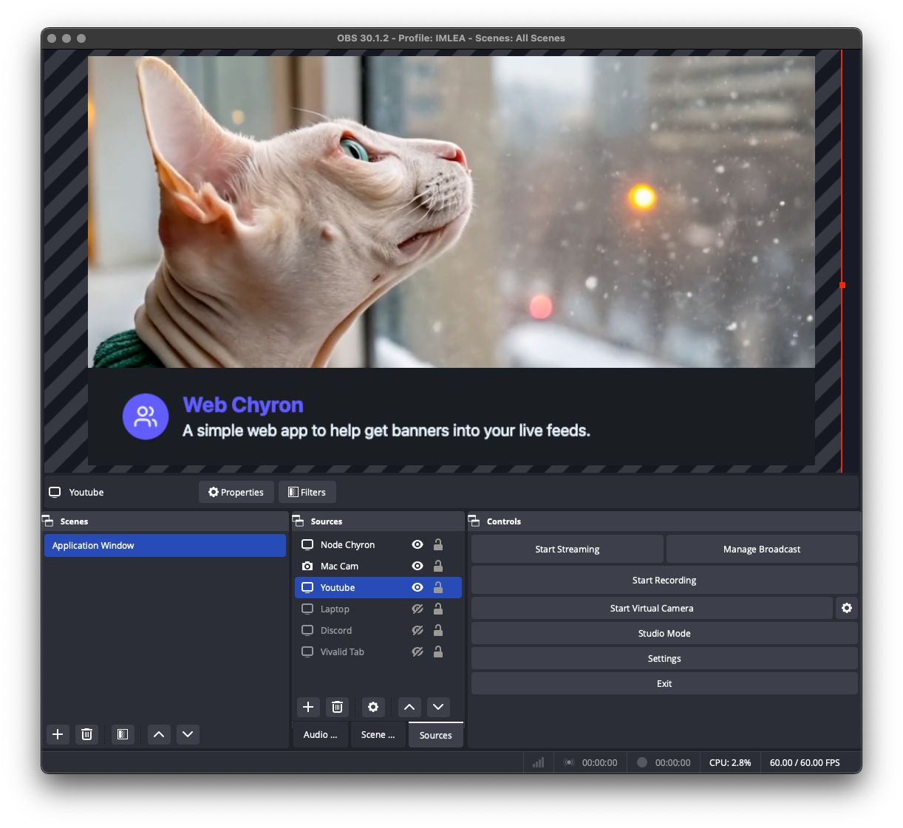
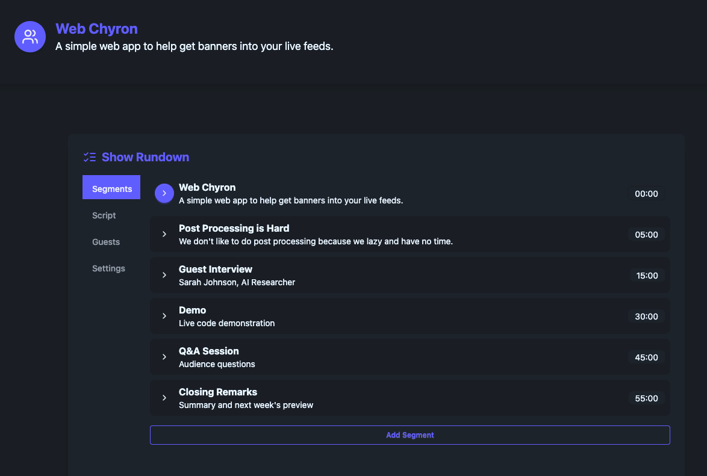

# Chyron App

A web-based application for creating and displaying customizable chyrons (graphical overlays) for live streaming and recording.

[]

[]

## Features

- Customizable text and icons for streaming overlays
- Real-time editing with content editable fields
- Smooth animations and transitions
- Local storage persistence
- Compatible with OBS Studio
- Built with Astro, Tailwind CSS, DaisyUI, and Lucide icons

## 🚀 Project Structure

```text
/
├── public/
├── src/
│   ├── layouts/
│   │   └── Layout.astro
│   ├── pages/
│   │   ├── index.astro
│   │   └── chyron.astro
│   └── styles/
│       └── global.css
├── package.json
└── tailwind.config.js
```

## 🧞 Commands

All commands are run from the root of the project, from a terminal:

| Command                   | Action                                           |
| :------------------------ | :----------------------------------------------- |
| `npm install`             | Installs dependencies                            |
| `npm run dev`             | Starts local dev server at `localhost:4321`      |
| `npm run build`           | Build your production site to `./dist/`          |
| `npm run preview`         | Preview your build locally, before deploying     |

## OBS Integration

1. In OBS Studio, add a new "Browser" source
2. Set the URL to the Chyron page (e.g., http://localhost:4321/chyron)
3. Set an appropriate width and height (e.g., 1920x200)
4. Enable "Control audio via OBS" to prevent audio issues
5. Click "OK" to add the source

## License

MIT
